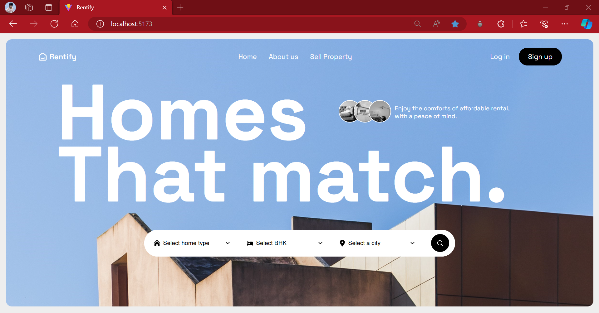
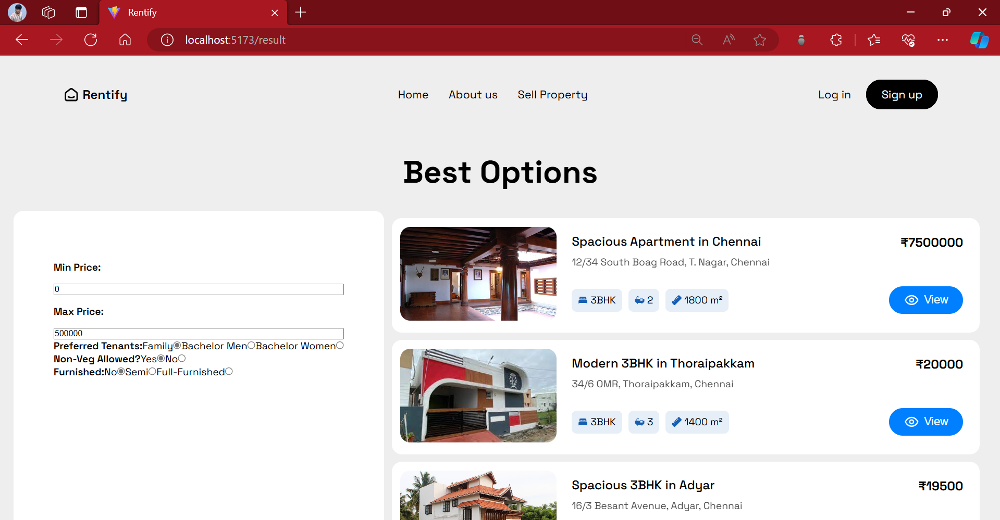
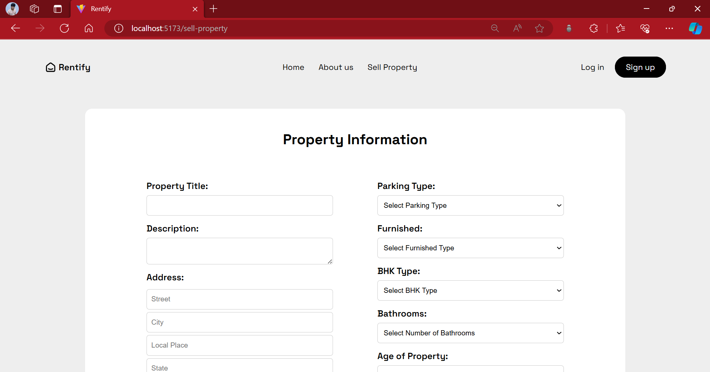
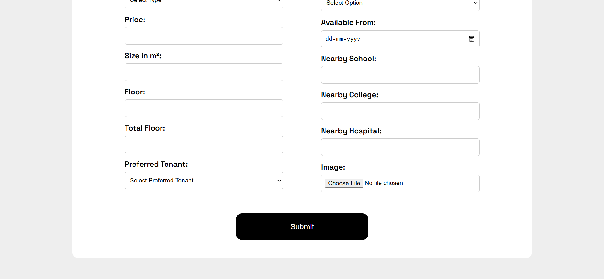

# Rentify Frontend
Welcome to the Rentify Frontend! Rentify is a real estate platform designed to streamline the process for both buyers and sellers. This repository contains the frontend code, providing an intuitive and user-friendly interface for property management and search functionalities.

## GitHub 

- *Frontend*: https://github.com/PrabanjanJeyasankar/rentify-presidio-task/client
- *Backend*: https://github.com/PrabanjanJeyasankar/rentify-presidio-task/server

## Features

- *User Registration and Login*: Secure and intuitive signup and login forms.
- *User Dashboard*: Personalized dashboard for buyers and sellers.
- *Property Listings*: Display property details with images, descriptions, and filters.
- *Property Search*: Advanced search functionality with filters like city, BHK, room type, etc.
- *Property Filter*: Advanced search options with tenant preference, non-veg preference, prices and furnished.
- *Property Management*: Sellers can post new properties and manage existing ones.

User Interface

